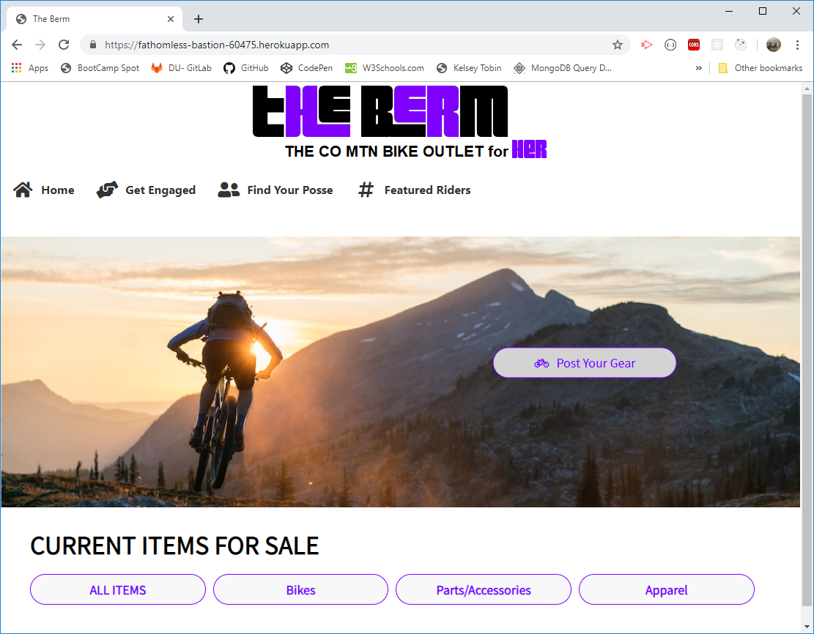
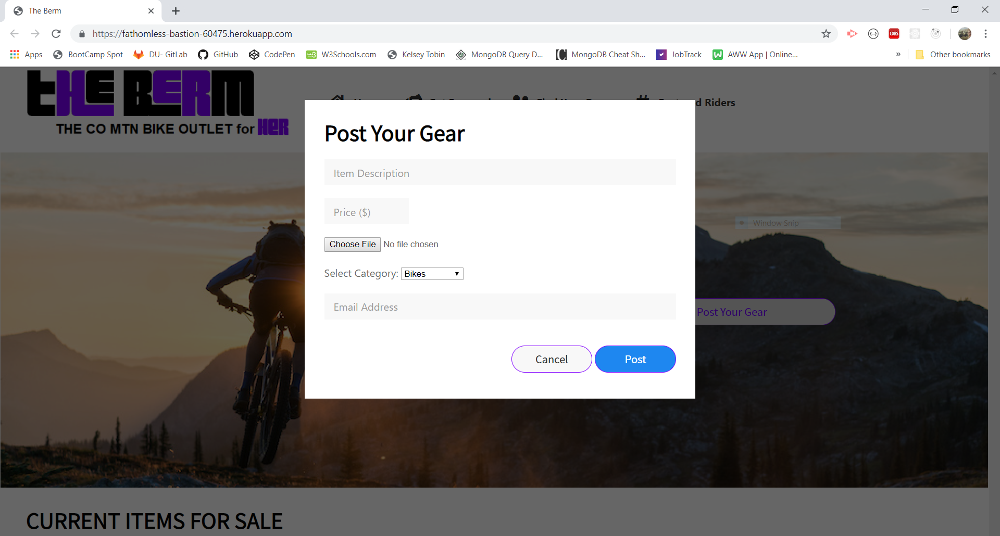

# The Berm

## Description
The Berm was built using a Node and Express.js web server. It is backed by a MySQL database and ORM Sequelize. We utilize both GET and POST requests to retrieve and post data to our API. The application is successfully deployed to Heroku and can be found by navigating to the link below. Our design structure follows the MVC paradigm and we implemented the UI Kit library to deliver a polished front end. 

### Navigate
https://fathomless-bastion-60475.herokuapp.com/

***

### The CO Mtn Bike Outlet for Women
* This application serves as a marketplace for women in Colorado who share the love for Mountain Biking

* Users are offered the ability to search for bike gear by categories, view all items for sale, or post their own items for sale. 

* Users can also view female specific mountain biking events or camps, stay up to date on some of the most popular female mountain bike athletes, and search for way to get involved in the mountain biking community.

* The Berm also offers weekly highlighted images from users displayed on front page

***
### Application Preview
#### Home 

#### Post

### Built With
* *Node.js 
* *Express.js
* *MySQL 
* *UI Kit
* *Handlebars
* *MVC Design

***
### Authors
* Kelsey Tobin
* Brittney Armentrout
* Rayna McGinnis
